---
author:
- Lecture Notes summarized by Neo
date: Semester 2 2021
title: |
    **COMP90086 Computer Vision\
    Week 2B\
    Image Filtering - Frequency Filtering**
---

Fourier Analysis (1D)
=====================

Signals 信号
------------

Any signal or pattern can be described as a sum of sinusoids.
所有信号都可以表示成很多正弦函数的叠加（和）。

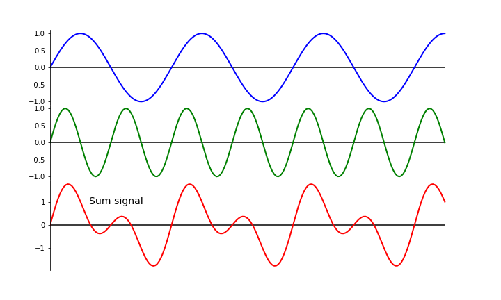{width="\textwidth"}

-   红色的复杂信号，可以分解成蓝色正弦函数信号与绿色正弦函数的叠加

-   **一张图片上截取一行Pixel，可以转换成一段信号，所以叫1D**

Sinusoids (Sine Waves) 正弦函数
-------------------------------

$$y=A\sin (wx+\varphi )$$ where

-   $A$ is amplitude

-   $w$ is frequency

-   $\varphi$ is phase

Fourier Transform 傅里叶变换
----------------------------

Fourier transform decomposes signal into component frequencies.\
傅里叶变换是一种线性积分变换，用于信号在时域（或空域）和频域之间的变换。

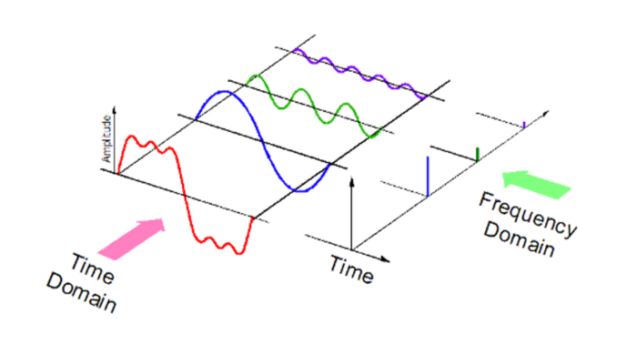{width="\textwidth"}

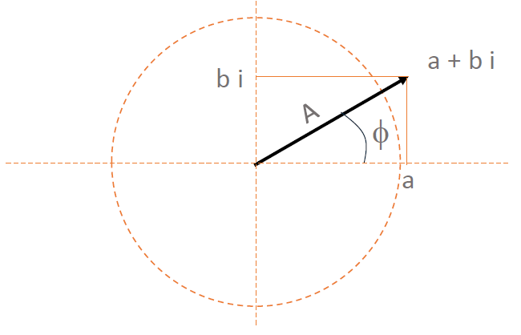{width="60%"}

-   Frequency Domain:

    -   The axis is frequency

    -   Values are complex numbers

    -   Magnitude = amplitude of the sinusoid

    -   Angle = phase of the sinusoid

### Formula (Not assessable) {#formula-not-assessable .unnumbered}

$$F(w)=\int_{-\infty}^{\infty}f(x)e^{-2i\pi wx} dx$$
一般有包可以直接用，例如scipy.fft(1D), scipy.fft2(2D), scipy.fftn(3D+)

Fourier Analysis (Image 2D)
===========================

在2D图像中，x轴与y轴可分别做傅里叶变换并放到右图以0freq为中心的轴中。

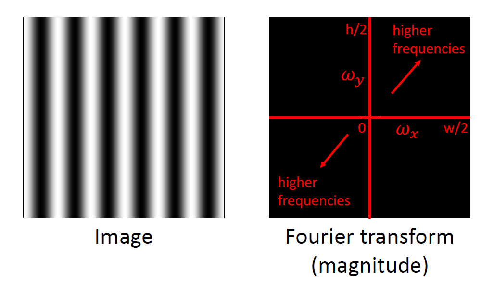{width="\textwidth"}

频率图中坐标表示不同的频率，白点的亮度代表频率的大小。

Examples {#examples .unnumbered}
--------

-   只有横坐标有frequency

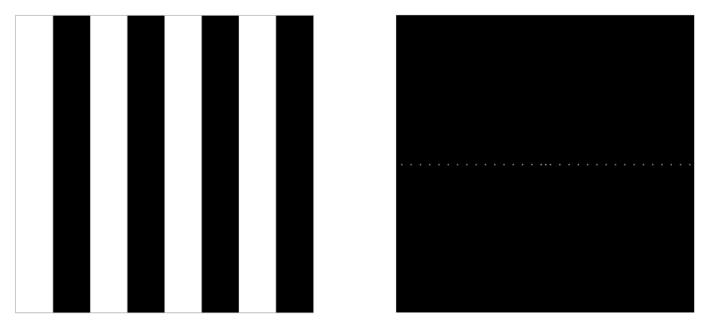{width="80%"}

-   横竖坐标都有frequency

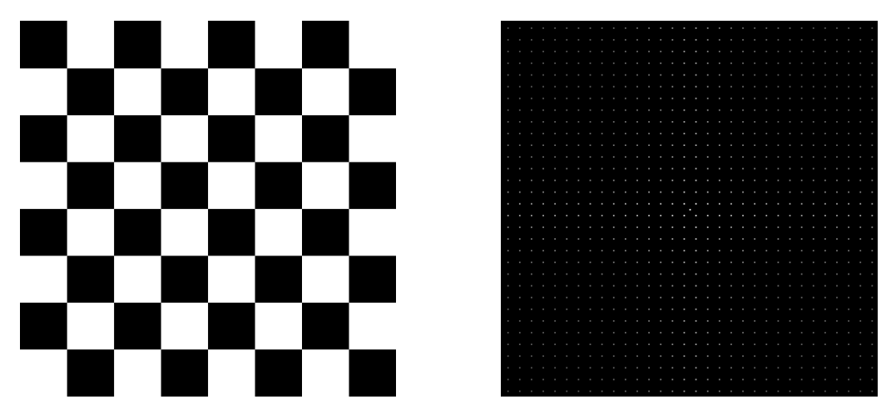{width="80%"}

-   真实的图片（大部分图片都类似，会有很多非常低的频率出现）

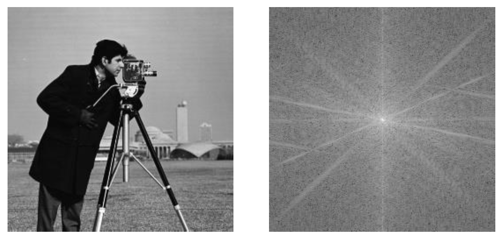{width="87%"}

Magnitude and Phase
-------------------

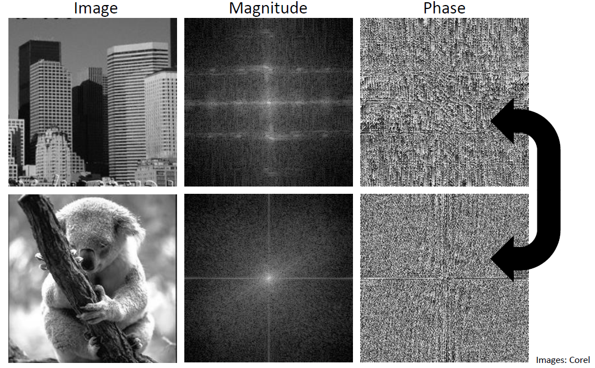{width="\textwidth"}

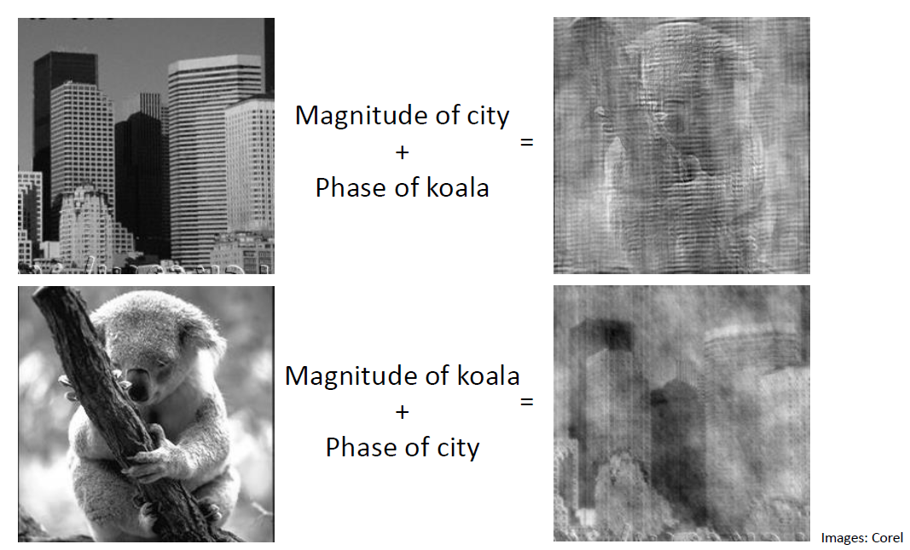{width="\textwidth"}

-   Any image can be represented by its Fourier transform

-   Fourier transform = for each frequency, magnitude (amplitude) +
    phase

-   Magnitude captures the holistic "texture" of an image, but the edges
    are mainly represented by Fourier phase

Frequency Filtering
===================

Operations in the spatial domain have equivalent operations in frequency
domain\
每个在空域的操作都有对应在频域的操作。

Convolution in spatial domain = multiplication in frequency domain\
空域卷积$=$频域相乘

Bandpass Filter
---------------

A filter that removes a range of frequencies from a signal.

Low Pass Filter
---------------

Keep low spatial frequencies, remove high frequencies.

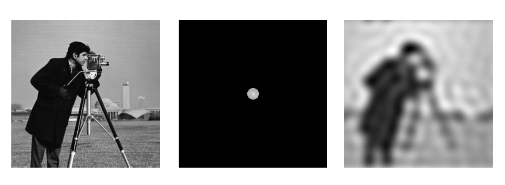{width="\textwidth"}

High Pass Filter
----------------

Keep high spatial frequencies, remove low frequencies.

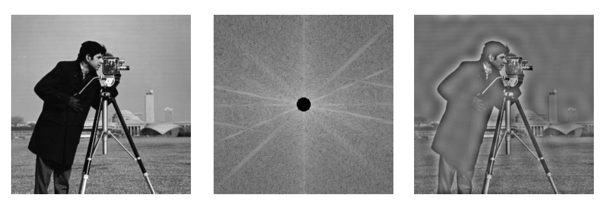{width="\textwidth"}

Filter Artefacts
----------------

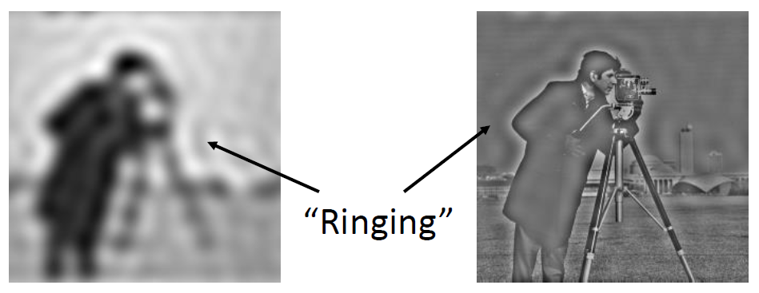{width="\textwidth"}

我们会发现直接使用Low/High
Pass的效果并不好，会使图片出现水滴状的效果，原因是因为没有使用"圆滑"的filter。

What we are doing:

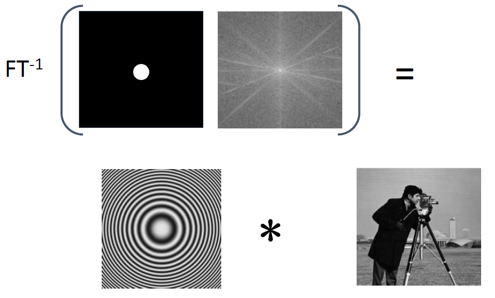{width="\textwidth"}

为了解决这种问题可以使用更为圆滑的Gaussian filters。

Gaussian Low Pass Filter
------------------------

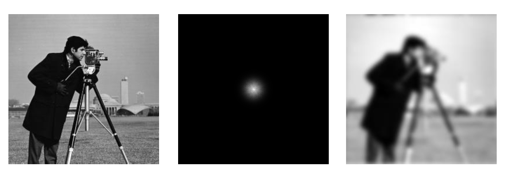{width="\textwidth"}

Gaussian High Pass Filter
-------------------------

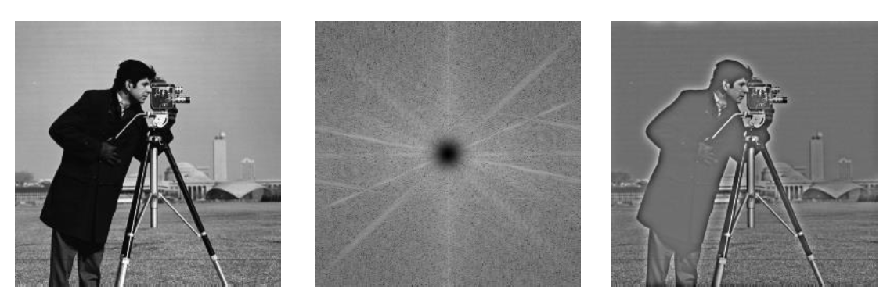{width="\textwidth"}

Applications
============

-   Image compression 图像压缩

    -   Human visual system is not very sensitive to contrast in high
        spatial frequencies

    -   Discarding information in high spatial frequencies doesn't
        change the "look" of an image

-   Image forensics 图像取证

-   Texture & scene representation

-   Shape representation
